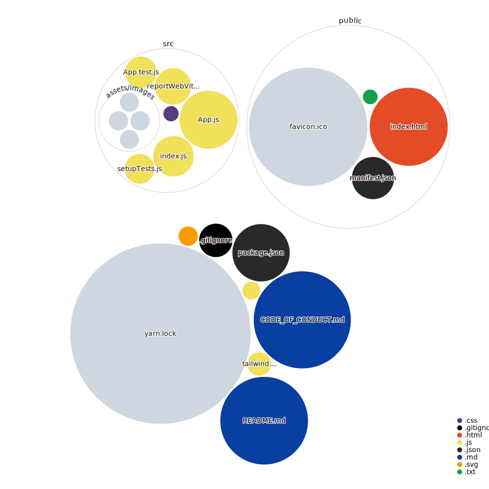

# LinkLey

Linkley is a private link sharing tool that provides a secure way to share links with others. It operates similarly to [bio.link](https://bio.link), but requires a 6 digit verification code for access, making it more secure and private than openly shared links.

## Tech Stack

**Client:**

- React.js
- Tailwind CSS

### Visualization of the codebase <br/>



## Features

- Live previews
- Add, update and delete links
- Add logos for each link preview
- Analytics and tracking for shared links.

## Run Locally

Clone the project

```bash
  git clone https://github.com/Linkley/linkley-frontend.git
```

Go to the project directory

```bash
  cd linkley-frontend
```

Install dependencies

```bash
  yarn install
```

Start the server

```bash
  yarn start
```

## Installation

- Install linkley-frontend with yarn

```bash
  npm install -g yarn
```

- Verify the installation

```bash
  yarn --version
```

## Contributing

Contributions are always welcome!

See `contributing.md` for ways to get started.

Please adhere to this project's `code of conduct`.

## License

[MIT](https://choosealicense.com/licenses/mit/)

## Screenshots


## Feedback

If you have any feedback, please reach out to:

- [Alwin John](mailto:alwinjohn231@gmail.com)
- [Riya P Mathew](mailto:riyapmathew2000@gmail.com)

## Acknowledgements

- [Readme Template Visualiser](https://github.com/Dexters-Hub/readme-template-visualizer)

- [Awesome Readme Templates](https://awesomeopensource.com/project/elangosundar/awesome-README-templates)
- [Awesome README](https://github.com/matiassingers/awesome-readme)
- [How to write a Good readme](https://bulldogjob.com/news/449-how-to-write-a-good-readme-for-your-github-project)

- [readme.so](https://github.com/octokatherine/readme.so)

- [Repo Visualizer](https://github.com/githubocto/repo-visualizer)

## Authors

- [@Dexters-Hub](https://github.com/Dexters-Hub)
- [@RiyaMathew-11](https://github.com/RiyaMathew-11)
